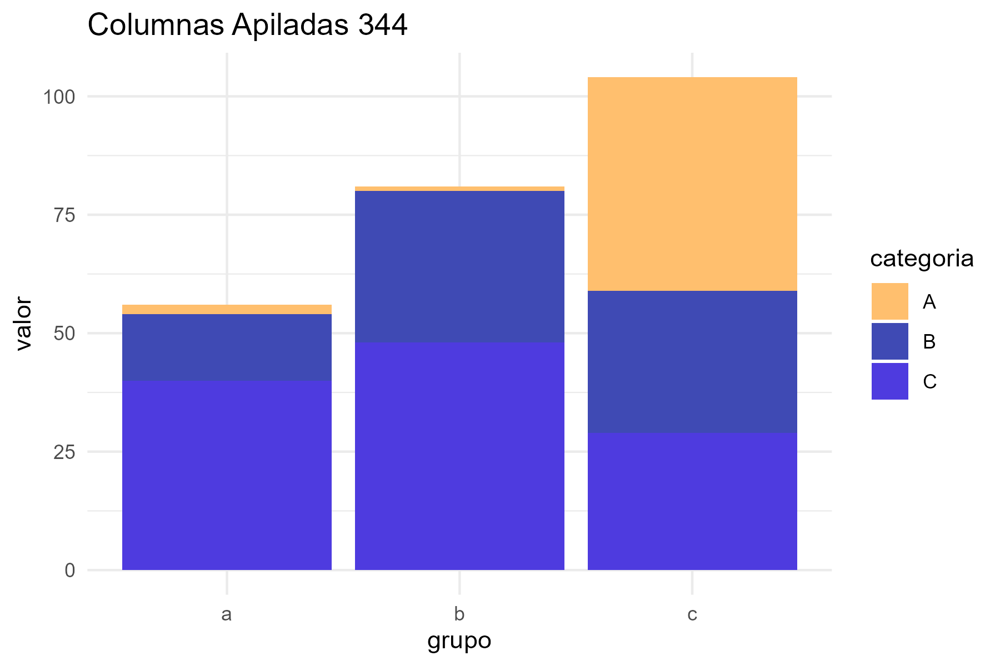

# wadaPalettes

**Color Palettes Based on the Works of Sanzo Wada**


---

## Table of Contents

1. [About](#about)  
2. [Installation](#installation)  
3. [Usage](#usage)  
   - [Get Palettes](#get-palettes)  
   - [Use with base R](#use-with-base-r)  
   - [Use with ggplot2](#use-with-ggplot2)  
4. [Gallery](#gallery)  
5. [Customization](#customization)  
6. [License](#license)  
7. [Contact](#contact)  

---

## About

Este paquete R implementa combinaciones de colores basadas en el trabajo clásico de Sanzo Wada, artista y experto en color japonés. Proporciona paletas armoniosas para su uso en gráficos y visualizaciones de datos.

Sanzo Wada (1883-1967) diseñó cientos de combinaciones armónicas de colores. Esta librería pone a tu disposición una selección de estas paletas para aplicaciones modernas en R.

---

## Installation

```r
# Instalación desde CRAN (cuando esté disponible)
install.packages("wadaPalettes")

# Instalación desde GitHub (versión desarrollo)
# devtools::install_github("tu_usuario/wadaPalettes")
```

## Usage

### Get Palettes

```r
library(wadaPalettes)

# Obtener paleta por ID
paleta <- obtener_combinacion_wada(335)
print(paleta$colores)
```

### Use with base R

```r
# Graficar puntos con la paleta
plot(1:length(paleta$colores), rep(1, length(paleta$colores)), 
     col = paleta$colores, pch = 19, cex = 4, xlab = "Índice", ylab = "", yaxt = "n")

```
### Use with ggplot2

```r
library(ggplot2)

ggplot(mpg, aes(x = class, fill = class)) +
  geom_bar() +
  scale_fill_manual(values = crear_paleta_colores(335, n = 7)) +
  theme_minimal() +
  ggtitle("Ejemplo de paleta Wada Sanzo en ggplot2")
  

```
## Gallery

| Paleta 331 | Paleta 342 | Paleta 350 |
|------------|------------|------------|
|  |  |  |

### Ejemplos ggplot2

| Area 250 | Barras 231 | Boxplot 300 |
|------------|------------|------------|
|  |  |  |


| Columnas Apiladas 50 | Dispersion 235 | Lineas 175 |
|------------|------------|------------|
|  |  |  |


| Barras 333 | Barras 313 | Boxplot 264 |
|------------|------------|------------|
|  |  |  |


| Columnas Apiladas 347 | Dispersion 264 | Columnas Apiladas 344 |
|------------|------------|------------|
|  |  |  |

## Customization

```r
p1 <- crear_paleta_colores(335, 3)
p2 <- crear_paleta_colores(331, 3)
custom <- c(p1, p2)
barplot(rep(1, length(custom)), col = custom, border = NA)
```


## License

MIT License. Consulta el archivo LICENSE para más detalles.

## Contact

Para preguntas o sugerencias, abre un issue en el repositorio GitHub:
https://github.com/tu_usuario/wadaPalettes


